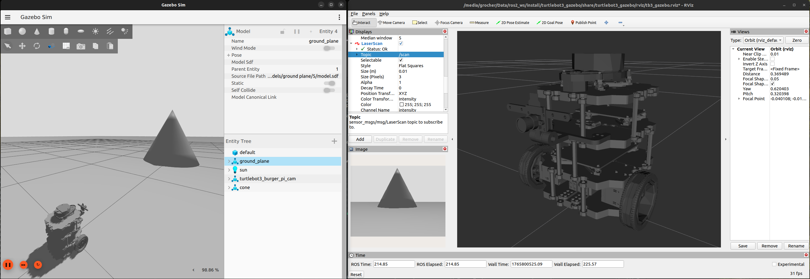
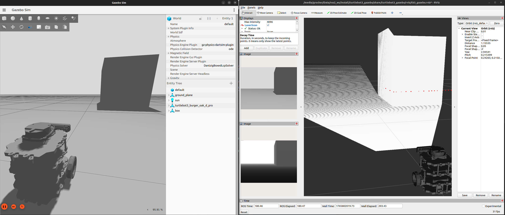
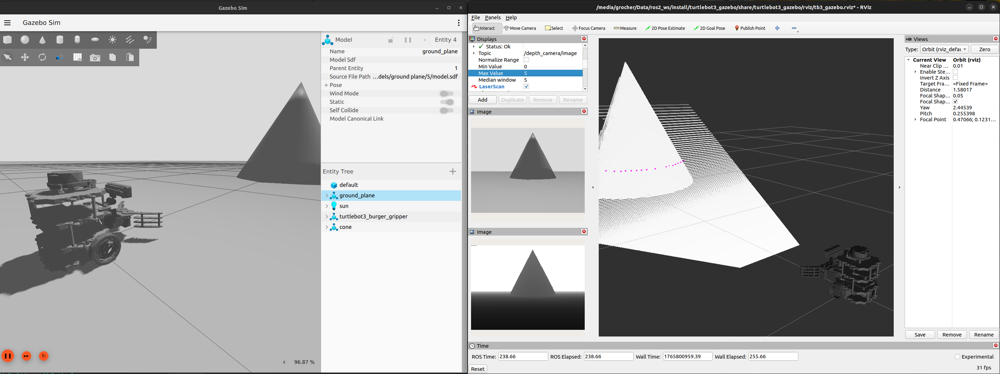
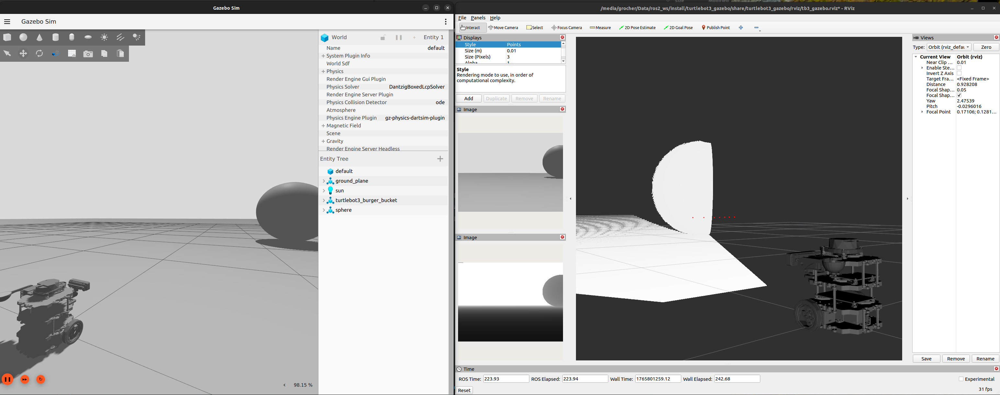

# Turtlebot3-based project descriptions

Turtlebot3 extended with a raspberry pi camera. 
```bash
$> export PROJECT_MODEL=turtlebot3_burger_pi_cam
$> ros2 launch turtlebot3_gazebo projects_empty_world.launch.py
```


Turtlebot3 extended with a Luxonis OAK-D Pro depth camera. 
```bash
$> export PROJECT_MODEL=turtlebot3_burger_oak_d_pro
$> ros2 launch turtlebot3_gazebo projects_empty_world.launch.py
```


Turtlebot3 extended with a Intel D435i depth camera. 
```bash
$> export PROJECT_MODEL=turtlebot3_burger_d435i
$> ros2 launch turtlebot3_gazebo projects_empty_world.launch.py
```


Turtlebot3 extended with a gripper & OAK-D Pro camera. 
```bash
$> export PROJECT_MODEL=turtlebot3_burger_gripper
$> ros2 launch turtlebot3_gazebo projects_empty_world.launch.py
```


Turtlebot3 extended with a bucket & OAK-D Pro camera. 
```bash
$> export PROJECT_MODEL=turtlebot3_burger_bucket
$> ros2 launch turtlebot3_gazebo projects_empty_world.launch.py
```


More to come...